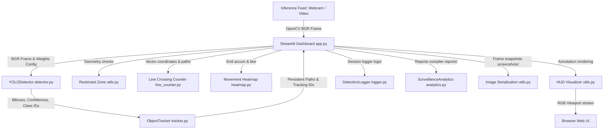

# 🛡️ Real-Time Smart Surveillance & Object Tracking Platform

An enterprise-grade, high-performance edge analytics and surveillance platform built using **Python, OpenCV, YOLOv8 (Ultralytics), and Streamlit**. The system detects, tracks, and counts objects in real-time while monitoring spatial perimeters (Restricted Zones), tracking directional Line Crossings (Entry/Exit events), and visualizing traffic distributions with glowing transparent heatmaps.

Designed with robust **Object-Oriented Programming (OOP)** patterns, this project demonstrates production-ready software engineering standards for computer vision, analytics, and interactive dashboard interfaces.

---

## 🚀 Core Features

1. **Real-Time Deep Learning Object Detection (YOLOv8)**: Multi-class object inference across COCO categories with adjustable confidence sliders and category filters.
2. **Robust Multi-Object Tracking (ByteTrack/BoT-SORT)**: Wraps state-of-the-art tracking models inside our decoupled tracker to preserve unique tracking IDs across frames and occlusions.
3. **Restricted Perimeter Alerts**: Monitors configurable rectangular zones by checking geometric box-center intersections. Emits alarm banners, triggers red visual zone overlays, and logs incidents instantly.
4. **Directional Line Crossing Counter**: Tracks vector intersections across a virtual horizontal line. Increments separate **Entry** (downwards movement) and **Exit** (upwards movement) variables while preventing ID duplication.
5. **Live Movement Heatmap**: Compiles spatial activity using a 2D float grid, blurs coordinates via Gaussian kernels, and maps distributions using BGR colormaps. Implements threshold-based background transparency to preserve a clean video feed.
6. **Detailed Analytics & Reports Center**: Maps active counts, displays temporal hourly activity line graphs, and generates pie charts. Includes multi-worksheet **Excel (.xlsx)** downloading support.
7. **Chronological History Timeline**: Dynamically reads log streams to construct a search-friendly event history log, filterable by date, class category, or event classification.
8. **Snapshot Repository**: Allows in-app snapshots (and keyboard 'S' bindings) of BGR feeds, showing images in an interactive download gallery.

---

## 📐 Decoupled Architecture Flow

Below is the modular data flow showing how video frames and metrics stream through our decoupled components:



---

## 📁 Repository Folder Tree

```text
smart_object_detection/
├── app.py                # Streamlit dashboard UI, layout grids, and visual tabs
├── detector.py           # YOLODetector (YOLOv8 wrapper for models download & inference)
├── tracker.py            # ObjectTracker (Multi-object tracking & persistent path history)
├── logger.py             # DetectionLogger (Thread-safe Daily rolling CSV database)
├── line_counter.py       # LineCrossingCounter (Directional entrance/exit vector crossing)
├── heatmap.py            # MovementHeatmap (2D Gaussian grid mapping & Jet blending)
├── analytics.py          # SurveillanceAnalytics (Pandas metric aggregation & Excel compilation)
├── utils.py              # Visual processing helper, coordinate scaling, and HUD overlays
├── requirements.txt      # Production package dependencies
├── README.md             # Standard documentation and guide (this file)
│
├── logs/                 # [Auto-created] Rolling session CSV spreadsheet logs
├── screenshots/          # [Auto-created] Snapshot JPEG gallery images
├── reports/              # [Auto-created] Generated Excel (.xlsx) and CSV reports
└── models/               # [Auto-created] YOLOv8 deep learning model weights (.pt)
```

---

## 🛠️ Step-by-Step Installation Guide

### Prerequisites
Make sure you have **Python 3.8 to 3.11** installed on your operating system. You can verify your version by running:
```bash
python --version
```

### 1. Clone or Move to Workspace
Open a terminal in the project directory:
```bash
cd "c:/Users/Mihir Hisaria/object detect/smart_object_detection"
```

### 2. Set Up a Virtual Environment (Recommended)
Create a clean environment to isolate package packages:
```bash
# Windows
python -m venv venv
venv\Scripts\activate

# Mac/Linux
python3 -m venv venv
source venv/bin/activate
```

### 3. Install Required Dependencies
Install all modules (including `openpyxl` for Excel generation and `altair` for graphs):
```bash
pip install -r requirements.txt
```

### 4. Run the Streamlit Surveillance Dashboard
Launch the web interface locally on your browser:
```bash
streamlit run app.py
```
By default, the application will host a server on your local port at `http://localhost:8501`.

---

## 🛡️ Modular Core Mechanics Explained

### 1. Virtual Line Crossing Algorithm
- Computes spatial crossings by storing the coordinate center paths of tracked objects over consecutive frames: `paths = {track_id: [(cx1, cy1), (cx2, cy2), ...]}`.
- If a horizontal line is defined at y-coordinate `ly`, the transition from `path[-2]` (previous frame) to `path[-1]` (current frame) is calculated:
  - **Entry (Downward)**: `prev_cy < ly` and `cy >= ly`.
  - **Exit (Upward)**: `prev_cy > ly` and `cy <= ly`.
- Integrates crossing flags to prevent duplicate counting during coordinate jitter at the line boundary.

### 2. Transparent Heatmap Overlay
- Utilizes a 2D float NumPy grid matching camera input dimensions.
- Every detection's center coordinates are processed as a Gaussian circular blob onto an activity mask and accumulated on the grid.
- Normalizes coordinates to `0-255` and maps colors using `cv2.applyColorMap(..., cv2.COLORMAP_JET)`.
- Generates a binary threshold mask to segment inactive cells, keeping the background 100% clean and transparent while active paths glow dynamically (Blue for low activity -> Red for high traffic).

### 3. Excel Reports Generator
- Dynamically parses rolling CSV log files via Pandas.
- Compiles multiple styled worksheets inside a single Excel workbook using the `openpyxl` engine:
  - **Sheet 1**: Executive Surveillance Metrics (Total tracked, Line Crossings, Perimeter violations).
  - **Sheet 2**: All categorical detection logs.
  - **Sheet 3**: Chronological Restricted Zone intrusion warnings.

---

## 💼 Professional Resume Summary Section
Copy-paste this technical snippet directly onto your CV or LinkedIn portfolio to showcase your skills:

> **AI Smart Surveillance & Edge Analytics Platform (Python, Streamlit, YOLOv8, OpenCV, Pandas, Excel Engine)**
> * **Engineered** a modular, edge-analytics surveillance dashboard achieving up to 30 FPS for real-time object detection and multi-object tracking.
> * **Integrated** YOLOv8 spatial inference with ByteTrack multi-object tracking models, implementing persistent path history arrays to trace directional line crossings (Entry/Exit events).
> * **Constructed** a live traffic heatmap module using 2D floating-point accumulator arrays and Gaussian blur kernels, color-mapping high-traffic centers via Jet grids and background threshold masks.
> * **Built** a thread-safe rolling logging database and automated multi-worksheet reports compiler, exporting executive KPI summaries and alerts to Excel (.xlsx) files using Pandas and Openpyxl.
